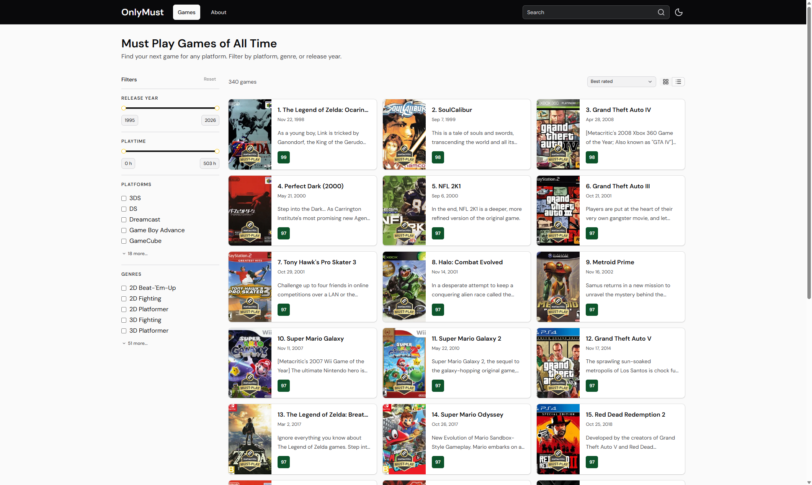

[](https://app.netlify.com/projects/onlymust/deploys)

# Only Must

> Browse every **Must Play** game — filter by platform, genre, and year to find your next game.

Too many games, not enough time. **Only Must** solves that by surfacing only the titles that earned Metacritic's highest distinction — then letting you slice through them by platform, genre, or release year until you find exactly what you want to play next.

## Screenshot



## Stack

| Layer        | Tech                                                                                       |
| ------------ | ------------------------------------------------------------------------------------------ |
| **Frontend** | [TanStack Start](https://tanstack.com/start) · React 19 · TanStack Router · TanStack Query |
| **Styling**  | Tailwind CSS v4 · shadcn/ui · Base UI                                                      |
| **Backend**  | Express 5 · Drizzle ORM · Neon (PostgreSQL) · Zod                                          |
| **Scraping** | Playwright (Metacritic)                                                                    |
| **Shared**   | `@only-must/shared` — Zod schemas + typed API client                                       |
| **Tooling**  | pnpm workspaces · Oxlint · Oxfmt · Husky · TypeScript                                      |
| **Deploy**   | Netlify (web)                                                                              |

## Project structure

```text
only-must/
├── apps/
│   ├── api/          # Express REST API
│   └── web/          # TanStack Start frontend
└── packages/
    └── shared/       # Shared Zod schemas & API client
```

## Getting started

### Prerequisites

- [Node.js](https://nodejs.org/) ≥ 22
- [pnpm](https://pnpm.io/) ≥ 11 (`npm i -g pnpm`)
- A [Neon](https://neon.tech/) PostgreSQL database

### Install

```bash
pnpm install
```

### Configure environment

Copy the API example file and fill in the values:

```bash
cp apps/api/.env.example apps/api/.env
```

| Variable       | Default                 | Description                       |
| -------------- | ----------------------- | --------------------------------- |
| `NODE_ENV`     | `development`           | Runtime environment               |
| `PORT`         | `5000`                  | API port                          |
| `DATABASE_URL` | —                       | Neon PostgreSQL connection URL    |
| `FRONTEND_URL` | `http://localhost:3000` | Allowed CORS origin in production |

### Run the database migrations

```bash
pnpm -F api db:migrate
```

### Start development servers

```bash
pnpm dev
```

This runs TypeScript watch, the API, and the web app concurrently.

| Service | URL                   |
| ------- | --------------------- |
| Web     | http://localhost:3000 |
| API     | http://localhost:5000 |

You can also start them individually:

```bash
pnpm dev:api   # API only
pnpm dev:web   # Web only
```

## Populating the database

The scraper uses Playwright to collect Must Play games from Metacritic. A GitHub Actions workflow runs the full pipeline automatically every day at 03:00 UTC, and can also be triggered manually from the Actions tab.

**Step 1 — Scrape the game list:**

```bash
pnpm -F api scrape
```

**Step 2 — Scrape game details** (platforms, genres, developers, release dates):

```bash
pnpm -F api scrape-details
```

**Step 3 — Sync HowLongToBeat durations:**

```bash
pnpm -F api sync:hltb
```

All scripts read `apps/api/.env` for the database connection.

## API reference

Base URL: `http://localhost:5000/api/v1`

### `GET /games`

Returns a paginated list of games.

| Query param      | Type                                                                                                      | Description                            |
| ---------------- | --------------------------------------------------------------------------------------------------------- | -------------------------------------- |
| `page`           | `number`                                                                                                  | Page number (default: `1`)             |
| `search`         | `string`                                                                                                  | Title search (case-insensitive)        |
| `platforms`      | `string \| string[]`                                                                                      | Filter by platform ID(s)               |
| `genres`         | `string \| string[]`                                                                                      | Filter by genre ID(s)                  |
| `releaseYear`    | `number`                                                                                                  | Exact release year                     |
| `releaseYearMin` | `number`                                                                                                  | Release year lower bound               |
| `releaseYearMax` | `number`                                                                                                  | Release year upper bound               |
| `playtimeMin`    | `number`                                                                                                  | Min main-story playtime in **hours**   |
| `playtimeMax`    | `number`                                                                                                  | Max main-story playtime in **hours**   |
| `sort`           | `metascore-desc` \| `release-asc` \| `release-desc` \| `shortest-duration-asc` \| `longest-duration-desc` | Sort order (default: `metascore-desc`) |

Each game in `data` includes a `durations` object with `mainStorySeconds`, `mainExtraSeconds`, and `completionistSeconds` sourced from HowLongToBeat (null when unavailable).

**Response:**

```json
{
  "data": [...],
  "meta": {
    "page": 1,
    "total": 842,
    "totalPages": 36,
    "hasNext": true,
    "hasPrev": false
  }
}
```

### `GET /games/duration-range`

Returns the min/max main-story duration (in hours) across all games that have HowLongToBeat data.

```json
{ "minMainStoryHours": 1, "maxMainStoryHours": 200 }
```

### `GET /games/:slug`

Returns a single game with its relations (platforms, genres, developers, and `durations`).

### `GET /platforms`

Returns all available platforms.

### `GET /genres`

Returns all available genres.

## Development scripts

| Command                      | Description                                |
| ---------------------------- | ------------------------------------------ |
| `pnpm dev`                   | Start API + web + TypeScript watch         |
| `pnpm dev:api`               | API only                                   |
| `pnpm dev:web`               | Web only                                   |
| `pnpm build`                 | Build all packages                         |
| `pnpm build:api`             | Build shared + API only                    |
| `pnpm build:web`             | Build shared + web only                    |
| `pnpm typecheck`             | Run TypeScript checks                      |
| `pnpm lint`                  | Lint with Oxlint                           |
| `pnpm lint:fix`              | Auto-fix lint issues                       |
| `pnpm format`                | Format with Oxfmt                          |
| `pnpm format:check`          | Check formatting without writing           |
| `pnpm -F api db:generate`    | Generate Drizzle migration files           |
| `pnpm -F api db:migrate`     | Apply pending migrations                   |
| `pnpm -F api scrape`         | Scrape game list from Metacritic           |
| `pnpm -F api scrape-details` | Scrape game details from Metacritic        |
| `pnpm -F api sync:hltb`      | Sync HowLongToBeat durations for all games |
